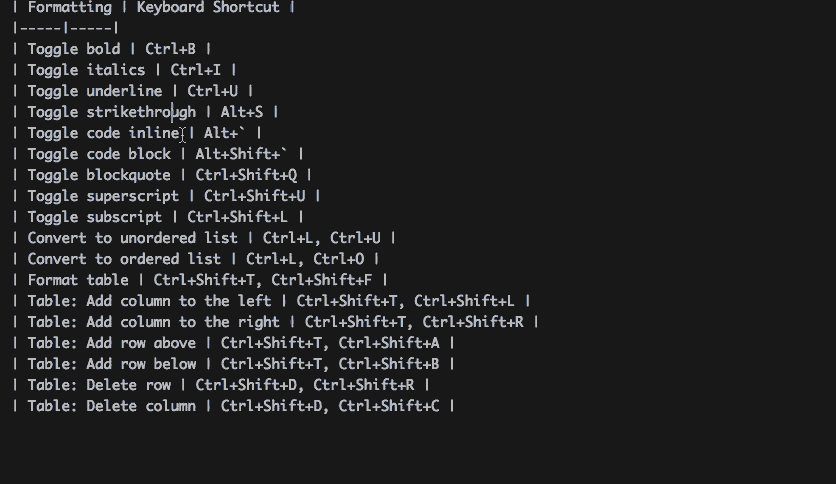
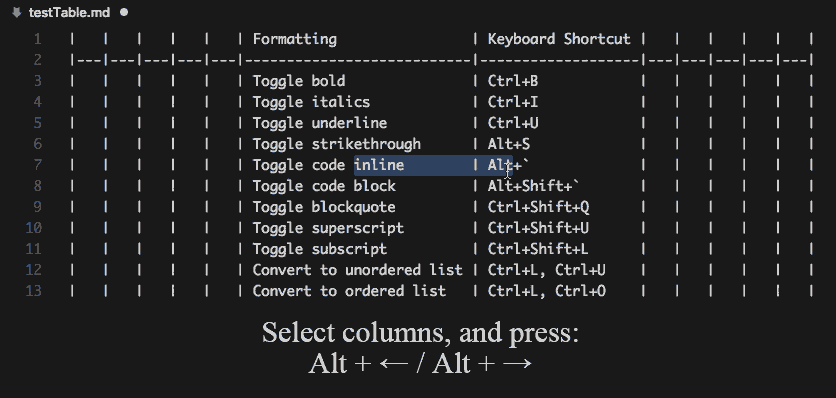
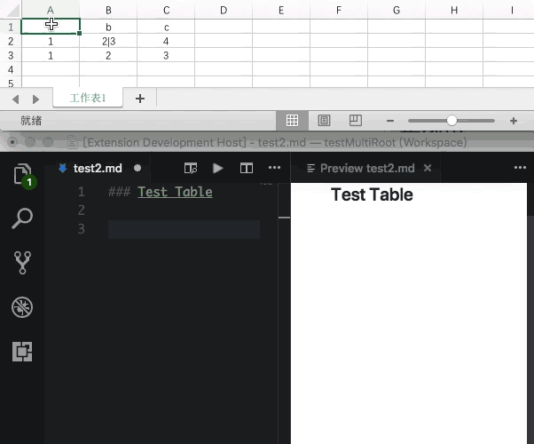
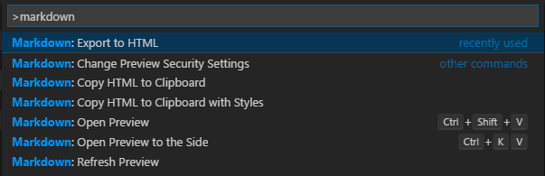
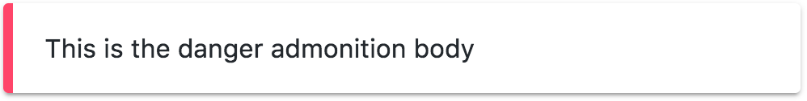
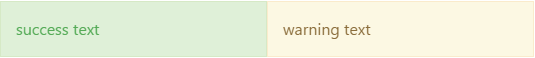

# Markdown Extended Readme

[](https://marketplace.visualstudio.com/items?itemName=jebbs.markdown-extended)
[](https://marketplace.visualstudio.com/items?itemName=jebbs.markdown-extended)

Markdown Extended is an extension extends syntaxes and abilities to VSCode built-in markdown function.

Markdown Extended includes lots of editing helpers and a `what you see is what you get` exporter, which means export files are consistent to what you see in markdown preview, even it contains syntaxes and styles contributed by other plugins.

## Features

- Exporter ([View Detail](#Exporter))

    - Export to Self Contained HTML / PDF / PNG / JPEG
    - Export current document / workspace
    - Copy exported HTML to clipboard
- Editing Helpers ([View Detail](#editing-helpers-and-keys)): 

    - Paste, format table.  
    - Add, delete and move table columns & rows.  
    - Toggle various formates, eg.: bold, italics, underline, strikethrough, code inline, code block, block quote, superscript, subscript, unordered list, ordered list.

- Extended Language Features ([View Detail](#extended-syntaxes)):

    - Admonition (built-in), [View Document](#admonition)
    - Enhanced Anchor Link (built-in), [View Document](#enhanced-anchor-link)
    - [markdown-it-table-of-contents](https://www.npmjs.com/package/markdown-it-table-of-contents)
    - [markdown-it-footnote](https://www.npmjs.com/package/markdown-it-footnote)
    - [markdown-it-abbr](https://www.npmjs.com/package/markdown-it-abbr)
    - [markdown-it-deflist](https://www.npmjs.com/package/markdown-it-deflist)
    - [markdown-it-sup](https://www.npmjs.com/package/markdown-it-sup)
    - [markdown-it-sub](https://www.npmjs.com/package/markdown-it-sub)
    - [markdown-it-checkbox](https://www.npmjs.com/package/markdown-it-checkbox)
    - [markdown-it-attrs](https://www.npmjs.com/package/markdown-it-attrs)
    - [markdown-it-kbd](https://www.npmjs.com/package/markdown-it-kbd)
    - [markdown-it-underline](https://www.npmjs.com/package/markdown-it-underline)
    - [markdown-it-multimd-table](https://www.npmjs.com/package/markdown-it-multimd-table)
    - [markdown-it-emoji](https://www.npmjs.com/package/markdown-it-emoji)
    - [markdown-it-html5-embed](https://www.npmjs.com/package/markdown-it-html5-embed)
    - [markdown-it-toc](https://www.npmjs.com/package/markdown-it-toc)
    - [markdown-it-container](https://www.npmjs.com/package/markdown-it-container)
    - [markdown-it-mark](https://www.npmjs.com/package/markdown-it-mark)

> Post an issue on [GitHub][issues] if you want other plugins.

### Disable Plugins

To disable integrated plugins, put their names separated with `,`:

```json
"markdownExtended.disabledPlugins": "underline, toc"
```

Available names: toc, container, admonition, footnote, abbr, sup, sub, checkbox, attrs, kbd, underline, mark, deflist, emoji, multimd-table, html5-embed

## Q: Why You Don't Integrate Some Plugin?

The extension works with other markdown plugin extensions (those who contribute to built-in Markdown engine) well, **Both Preview and Export**.
Like:
- [Markdown Preview Github Styling
](https://marketplace.visualstudio.com/items?itemName=bierner.markdown-preview-github-styles)
- [Markdown+Math](https://marketplace.visualstudio.com/items?itemName=goessner.mdmath) 
- [Markdown Preview Mermaid Support](https://marketplace.visualstudio.com/items?itemName=bierner.markdown-mermaid)

The extension does not tend to do all the work, so just use them, those plugins could be deeper developed, with better experience.

## Exporter

Find in command palette, or right click on an editor / workspace folder, and execute:

- `Markdown: Export to File`
- `Markdown: Export Markdown to File`

The export files are organized in `out` directory in the root of workspace folder by default.


### Export Configurations

You can configure exporting for multiple documents with user settings.

Further, you can add per-file settings inside markdown to override user settings, it has the highest priority:

```markdown
---
puppeteer:
    pdf:
        format: A4
        displayHeaderFooter: true
        margin:
            top: 1cm
            right: 1cm
            bottom: 1cm
            left: 1cm
    image:
        quality: 90
        fullPage: true
---
contents goes here...
```

See all available settings for 
[puppeteer.pdf](https://github.com/GoogleChrome/puppeteer/blob/v1.4.0/docs/api.md#pagepdfoptions), and
[puppeteer.image](https://github.com/GoogleChrome/puppeteer/blob/v1.4.0/docs/api.md#pagescreenshotoptions)

## Helpers

### Editing Helpers and Keys

> Inspired by 
[joshbax.mdhelper](https://marketplace.visualstudio.com/items?itemName=joshbax.mdhelper),
but totally new implements.

Default Keyboard Shortcut bindings are removed due to conflict issues on platforms, please consider:
>
- Switch to use command palette
- Switch to use [Snippets](#Snippets)
- Setup key bindings on your own

| Command                       | Keyboard Shortcut                 |
| ----------------------------- | --------------------------------- |
| Format: Toggle Bold           | ~~Ctrl+B~~                        |
| Format: Toggle Italics        | ~~Ctrl+I~~                        |
| Format: Toggle Underline      | ~~Ctrl+U~~                        |
| Format: Toggle Mark           | ~~Ctrl+M~~                        |
| Format: Toggle Strikethrough  | ~~Alt+S~~                         |
| Format: Toggle Code Inline    | ~~Alt+`~~                         |
| Format: Toggle Code Block     | ~~Alt+Shift+`~~                   |
| Format: Toggle Block Quote    | ~~Ctrl+Shift+Q~~                  |
| Format: Toggle Superscript    | ~~Ctrl+Shift+U~~                  |
| Format: Toggle Subscript      | ~~Ctrl+Shift+L~~                  |
| Format: Toggle Unordered List | ~~Ctrl+L, Ctrl+U~~                |
| Format: Toggle Ordered List   | ~~Ctrl+L, Ctrl+O~~                |
| Table: Paste as Table         | ~~Ctrl+Shift+T, Ctrl+Shift+P~~    |
| Table: Format Table           | ~~Ctrl+Shift+T, Ctrl+Shift+F~~    |
| Table: Add Columns to Left    | ~~Ctrl+Shift+T, Ctrl+Shift+L~~    |
| Table: Add Columns to Right   | ~~Ctrl+Shift+T, Ctrl+Shift+R~~    |
| Table: Add Rows Above         | ~~Ctrl+Shift+T, Ctrl+Shift+A~~    |
| Table: Add Row Below          | ~~Ctrl+Shift+T, Ctrl+Shift+B~~    |
| Table: Move Columns Left      | ~~Ctrl+Shift+T Ctrl+Shift+Left~~  |
| Table: Move Columns Right     | ~~Ctrl+Shift+T Ctrl+Shift+Right~~ |
| Table: Delete Rows            | ~~Ctrl+Shift+D, Ctrl+Shift+R~~    |
| Table: Delete Columns         | ~~Ctrl+Shift+D, Ctrl+Shift+C~~    |

> Looking for `Move Rows Up / Down`?  
> You can use vscode built-in `Move Line Up / Down`, shortcuts are `alt+↑` and `alt+↓`

### Snippets

| Index |              Prefix |               Context                | View                                |
| ----- | ------------------: | :----------------------------------: | :---------------------------------- |
| 0     |         `underline` |            `_under_ line`            | _under_ line                        |
| 1     |              `mark` |              `==mark==`              | ==mark==                            |
| 2     |         `subscript` |            `~sub~script`             | ~sub~script                         |
| 3     |       `superscript` |           `^super^script`            | ^super^script                       |
| 4     |          `checkbox` |            `[] checkbox`             | [ ] checkbox                        |
| 4     |          `tasklist` |             `- [] task`              | [ ] tasklist                        |
| 5     |             `table` | [Markdown](#paste-as-markdown-table) | [Table](#paste-as-markdown-table)   |
| 6     |               `kbd` |        `<kbd>Keyboard</kbd>`         | <kbd>Keyboard</kbd>                 |
| 7     | `admonition` `note` |         `!!! warn`<br>`text`         | [addmonition](#admonition)          |
| 8     |          `footnote` |     `[^abc]`  <br> `[^abc]: ABC`     | [footnote](#markdown-it-footnote)   |
| 9     |         `container` |  [markdown](#markdown-it-container)  | [container](#markdown-it-container) |
| 10    |              `abbr` |       `*[ABBR]: Abbreviation `       | [abbr](#markdown-it-abbr)           |
| 11    |              `attr` |    `**attr**{style="color:red"}`     | **attr**{style="color:red"}         |
| 12    |             `color` |  `color <font color=red>red</font>`  | color <font color=red>red</font>    |

### Table Editing





> Move columns key bindings has been changed to `ctrl+shift+t ctrl+shift+left/right`, due to [#57](https://github.com/qjebbs/vscode-markdown-extended/issues/57), [#68](https://github.com/qjebbs/vscode-markdown-extended/issues/68)

### Paste as Markdown Table

Copy a table from Excel, Web and other applications which support the format of Comma-Separated Values (CSV), then run the command `Paste as Markdown Table`, you will get the markdown table.



### Export & Copy



## Extended Syntaxes

### Admonition

> Inspired by [MkDocs](https://squidfunk.github.io/mkdocs-material/extensions/admonition/)

Nesting supported (by indent) admonition, the following shows a danger admonition nested by a note admonition.

```markdown
!!! note

    This is the **note** admonition body

    !!! danger Danger Title
        This is the **danger** admonition body
```


#### Removing Admonition Title

```markdown
!!! danger ""
    This is the danger admonition body
```



#### Supported Qualifiers

`note` | `summary, abstract, tldr` | `info, todo` | `tip, hint` | `success, check, done` | `question, help, faq` | `warning, attention, caution` | `failure, fail, missing` | `danger, error, bug` | `example, snippet` | `quote, cite`

### Enhanced Anchor Link

Now, you're able to write anchor links consistent to heading texts.

```markdown
Go to 
[简体中文](#简体中文), 
[Español Título](#Español-Título).

## 简体中文

Lorem ipsum dolor sit amet, consectetur adipiscing elit. 
Aenean euismod bibendum laoreet.

## Español Título

Lorem ipsum dolor sit amet, consectetur adipiscing elit. 
Aenean euismod bibendum laoreet.
```

### markdown-it-table-of-contents

    [[TOC]]

<div>
<ul><li><a href="#markdown-extended-readme">Markdown Extended Readme</a><ul><li><a href="#features">Features</a></li><li><a href="#requirements">Requirements</a></li><li><a href="#demos">Demos</a><ul>
</div>

### markdown-it-footnote

    Here is a footnote reference,[^1] and another.[^longnote]

    [^1]: Here is the footnote.
    [^longnote]: Here's one with multiple blocks.

<p data-line="6" class="code-line">Here is a footnote reference,<sup class="footnote-ref"><a href="#fn1" id="fnref1">[1]</a></sup> and another.<sup class="footnote-ref"><a href="#fn2" id="fnref2">[2]</a></sup></p>

### markdown-it-abbr

    *[HTML]: Hyper Text Markup Language
    *[W3C]:  World Wide Web Consortium
    The HTML specification
    is maintained by the W3C.

<p data-line="15" class="code-line">The <abbr title="Hyper Text Markup Language">HTML</abbr> specification
is maintained by the <abbr title="World Wide Web Consortium">W3C</abbr>.</p>

### markdown-it-deflist

    Apple
    :   Pomaceous fruit of plants of the genus Malus in the family Rosaceae.

<dl>
<dt>Apple</dt>
<dd>Pomaceous fruit of plants of the genus Malus in the family Rosaceae.</dd>
</dl>

### markdown-it-sup markdown-it-sub

    29^th^, H~2~O

<p data-line="20" class="code-line">29<sup>th</sup>, H<sub>2</sub>O</p>

### markdown-it-checkbox

    [ ] unchecked
    [x] checked

<p data-line="24" class="code-line"><input type="checkbox" id="checkbox71"><label for="checkbox71">unchecked</label>
<input type="checkbox" id="checkbox70" checked="true"><label for="checkbox70">checked</label></p>


### markdown-it-attrs

    item **bold red**{style="color:red"}

<p data-line="40" class="code-line">item <strong style="color:red">bold red</strong></p>

### markdown-it-kbd

    [[Ctrl+Esc]]

<p data-line="44" class="code-line"><kbd>Ctrl+Esc</kbd></p>

### markdown-it-underline

    _underline_

<p data-line="48" class="code-line"><u>underline</u></p>

### markdown-it-container

    ::::: container
    :::: row
    ::: col-xs-6 alert alert-success
    success text
    :::
    ::: col-xs-6 alert alert-warning
    warning text
    :::
    ::::
    :::::



*(Rendered with style bootstrap, to see the same result, you need the follow config)*

```json
"markdown.styles": [
    "https://maxcdn.bootstrapcdn.com/bootstrap/4.0.0/css/bootstrap.min.css"
]
```

## Known Issues & Feedback

Please post and view issues on [GitHub][issues]

**Enjoy!**

[issues]: https://github.com/qjebbs/vscode-markdown-extended/issues "Post issues"
