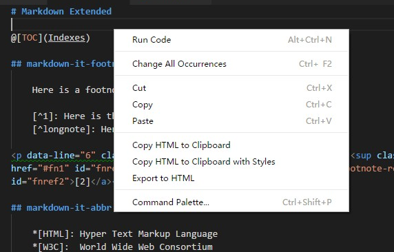
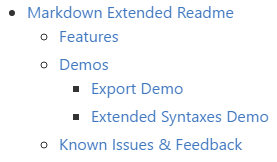

# Markdown Extended Readme

Markdown Extended is a plugin that extend syntaxes and abilities to VSCode built-in markdown function.

> It's highly recommended to use this plugin with Markdown Styling plugins, or the export HTML pages are not styled:  
> [Markdown Preview Github Styling](https://marketplace.visualstudio.com/items?itemName=bierner.markdown-preview-github-styles)

## Features

This plugin provides what you see is what you get exporter. That means rendered HTML page is consistent to what you see in markdown preview, even it contains syntaxes and styles contributed by other plugins.

- Extended Ability
    - Export to HTML
    - Copy HTML to clipboard
- Extended Plugins
    - [markdown-it-footnote](https://www.npmjs.com/package/markdown-it-footnote)
    - [markdown-it-abbr](https://www.npmjs.com/package/markdown-it-abbr)
    - [markdown-it-sup](https://www.npmjs.com/package/markdown-it-sup)
    - [markdown-it-sub](https://www.npmjs.com/package/markdown-it-sub)
    - [markdown-it-checkbox](https://www.npmjs.com/package/markdown-it-checkbox)
    - [markdown-it-attrs](https://www.npmjs.com/package/markdown-it-attrs)
    - [markdown-it-kbd](https://www.npmjs.com/package/markdown-it-kbd)
    - [markdown-it-underline](https://www.npmjs.com/package/markdown-it-underline)

> Post an issue on [GitHub][issues] if you want other plugins.

## Demos

### Export Demo

### Extended Syntaxes Demo

#### markdown-it-toc

    @[TOC](Indexes)

#### markdown-it-footnote

    Here is a footnote reference,[^1] and another.[^longnote]

    [^1]: Here is the footnote.
    [^longnote]: Here's one with multiple blocks.

Here is a footnote reference,<a href="#fn1" id="fnref1">[1]</a> and another.<a href="#fn2" id="fnref2">[2]</a>

#### markdown-it-abbr

    *[HTML]: Hyper Text Markup Language
    *[W3C]:  World Wide Web Consortium
    The HTML specification
    is maintained by the W3C.

The <abbr title="Hyper Text Markup Language">HTML</abbr> specification
is maintained by the <abbr title="World Wide Web Consortium">W3C</abbr>.

#### markdown-it-sup markdown-it-sub

    29^th^, H~2~O

29th, H2O

#### markdown-it-checkbox

    [ ] unchecked
    [x] checked

<input type="checkbox" id="checkbox71"><label for="checkbox71">unchecked</label>
<input type="checkbox" id="checkbox70" checked="true"><label for="checkbox70">checked</label>

#### markdown-it-attrs

    item **bold red**{style="color:red"}

item <strong style="color:red">bold red</strong>

#### markdown-it-kbd

    [[Ctrl+Esc]]

<kbd>Ctrl+Esc</kbd>

#### markdown-it-underline

    _underline_

<u>underline</u>

## Known Issues & Feedback

Please post and view issues on [GitHub][issues]

**Enjoy!**

[issues]: https://github.com/qjebbs/vscode-markdown-extended/issues "Post issues"