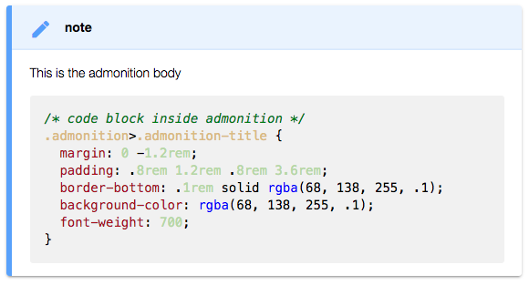

# Markdown Extended Readme

Markdown Extended is a extension that extend syntaxes and abilities to VSCode built-in markdown function, including lots of editing helpers and a `what you see is what you get exporter`, which means export files are consistent to what you see in markdown preview, even it contains syntaxes and styles contributed by other plugins.

## Features

- Exporter

    - Export to Self Contained HTML / PDF / PNG / JPEG
    - Export current document / workspace
    - Copy exported HTML to clipboard
- Editing Helpers ([View Detail](#editing-helpers-and-keys)): 

    - Paste, format table.  
    - Add, delete and move table columns & rows.  
    - Toggle various formates, eg.: bold, italics, underline, strikethrough, code inline, code block, block quote, superscript, subscript, unordered list, ordered list.

- Extended Language Features ([View Detail](#extended-syntaxes)):

    - Enhanced anchor link, table of contents, footnote, abbr, deflist, admonition, sup, sub, checkbox, attrs, kbd, underline.

## Export Configurations

You can configure exporting for multiple documents with user settings.

Further, you can add per-file settings inside markdown to override user settings, it has the highest priority:

```markdown
---
puppeteer:
    pdf:
        format: A4
        displayHeaderFooter: true
        margin:
            top: 1cm
            right: 1cm
            bottom: 1cm
            left: 1cm
    image:
        quality: 90
        fullPage: true
---
contents goes here...
```

See all available settings for 
[puppeteer.pdf](https://github.com/GoogleChrome/puppeteer/blob/v1.4.0/docs/api.md#pagepdfoptions), and
[puppeteer.image](https://github.com/GoogleChrome/puppeteer/blob/v1.4.0/docs/api.md#pagescreenshotoptions)

## Demos

### Table Editing


### Paste as Markdown Table

Copy a table from Excel, Web and other applications which support the format of Comma-Separated Values (CSV), then run the command `Paste as Markdown Table`, you will get the markdown table.


### Export & Copy


## Editing Helpers and Keys

> Inspired by 
[joshbax.mdhelper](https://marketplace.visualstudio.com/items?itemName=joshbax.mdhelper),
but totally new implements.

| Command                       | Keyboard Shortcut          |
|-------------------------------|----------------------------|
| Format: Toggle Bold           | Ctrl+B                     |
| Format: Toggle Italics        | Ctrl+I                     |
| Format: Toggle Underline      | Ctrl+U                     |
| Format: Toggle Strikethrough  | Alt+S                      |
| Format: Toggle Code Inline    | Alt+`                      |
| Format: Toggle Code Block     | Alt+Shift+`                |
| Format: Toggle Block Quote    | Ctrl+Shift+Q               |
| Format: Toggle Superscript    | Ctrl+Shift+U               |
| Format: Toggle Subscript      | Ctrl+Shift+L               |
| Format: Toggle Unordered List | Ctrl+L, Ctrl+U             |
| Format: Toggle Ordered List   | Ctrl+L, Ctrl+O             |
| Table: Paste as Table         | Ctrl+Shift+T, Ctrl+Shift+P |
| Table: Format Table           | Ctrl+Shift+T, Ctrl+Shift+F |
| Table: Add Columns to Left    | Ctrl+Shift+T, Ctrl+Shift+L |
| Table: Add Columns to Right   | Ctrl+Shift+T, Ctrl+Shift+R |
| Table: Add Rows Above         | Ctrl+Shift+T, Ctrl+Shift+A |
| Table: Add Row Below          | Ctrl+Shift+T, Ctrl+Shift+B |
| Table: Delete Rows            | Ctrl+Shift+D, Ctrl+Shift+R |
| Table: Delete Columns         | Ctrl+Shift+D, Ctrl+Shift+C |
| Table: Move Columns Left      | alt+←                      |
| Table: Move Columns Right     | alt+→                      |

> Looking for `Move Rows Up / Down`?  
> You can use vscode built-in `Move Line Up / Down`, shortcuts are `alt+↑` and `alt+↓`

## Extended Syntaxes

- Enhanced Anchor Link
- [markdown-it-table-of-contents](https://www.npmjs.com/package/markdown-it-table-of-contents)
- [markdown-it-footnote](https://www.npmjs.com/package/markdown-it-footnote)
- [markdown-it-abbr](https://www.npmjs.com/package/markdown-it-abbr)
- [markdown-it-deflist](https://www.npmjs.com/package/markdown-it-deflist)
- [markdown-it-admonition](https://www.npmjs.com/package/markdown-it-admonition)
- [markdown-it-sup](https://www.npmjs.com/package/markdown-it-sup)
- [markdown-it-sub](https://www.npmjs.com/package/markdown-it-sub)
- [markdown-it-checkbox](https://www.npmjs.com/package/markdown-it-checkbox)
- [markdown-it-attrs](https://www.npmjs.com/package/markdown-it-attrs)
- [markdown-it-kbd](https://www.npmjs.com/package/markdown-it-kbd)
- [markdown-it-underline](https://www.npmjs.com/package/markdown-it-underline)

> Post an issue on [GitHub][issues] if you want other plugins.

### Enhanced Anchor Link

Now, you're able to write anchor links consistent to heading texts.

```markdown
Go to 
[简体中文](#简体中文), 
[Español Título](#Español-Título).

## 简体中文

Lorem ipsum dolor sit amet, consectetur adipiscing elit. 
Aenean euismod bibendum laoreet.

## Español Título

Lorem ipsum dolor sit amet, consectetur adipiscing elit. 
Aenean euismod bibendum laoreet.
```

### markdown-it-table-of-contents

    [[TOC]]

<div>
<ul><li><a href="#markdown-extended-readme">Markdown Extended Readme</a><ul><li><a href="#features">Features</a></li><li><a href="#requirements">Requirements</a></li><li><a href="#demos">Demos</a><ul>
</div>

### markdown-it-footnote

    Here is a footnote reference,[^1] and another.[^longnote]

    [^1]: Here is the footnote.
    [^longnote]: Here's one with multiple blocks.

<p data-line="6" class="code-line">Here is a footnote reference,<sup class="footnote-ref"><a href="#fn1" id="fnref1">[1]</a></sup> and another.<sup class="footnote-ref"><a href="#fn2" id="fnref2">[2]</a></sup></p>

### markdown-it-abbr

    *[HTML]: Hyper Text Markup Language
    *[W3C]:  World Wide Web Consortium
    The HTML specification
    is maintained by the W3C.

<p data-line="15" class="code-line">The <abbr title="Hyper Text Markup Language">HTML</abbr> specification
is maintained by the <abbr title="World Wide Web Consortium">W3C</abbr>.</p>

### markdown-it-deflist

    Apple
    :   Pomaceous fruit of plants of the genus Malus in the family Rosaceae.

<dl>
<dt>Apple</dt>
<dd>Pomaceous fruit of plants of the genus Malus in the family Rosaceae.</dd>
</dl>

### markdown-it-admonition

    !!! note
    This is the admonition body
    ```css
    /* code block inside admonition */
    .admonition>.admonition-title {
    margin: 0 -1.2rem;
    padding: .8rem 1.2rem .8rem 3.6rem;
    border-bottom: .1rem solid rgba(68, 138, 255, .1);
    background-color: rgba(68, 138, 255, .1);
    font-weight: 700;
    }
    ```
    !!!



### markdown-it-sup markdown-it-sub

    29^th^, H~2~O

<p data-line="20" class="code-line">29<sup>th</sup>, H<sub>2</sub>O</p>

### markdown-it-checkbox

    [ ] unchecked
    [x] checked

<p data-line="24" class="code-line"><input type="checkbox" id="checkbox71"><label for="checkbox71">unchecked</label>
<input type="checkbox" id="checkbox70" checked="true"><label for="checkbox70">checked</label></p>


### markdown-it-attrs

    item **bold red**{style="color:red"}

<p data-line="40" class="code-line">item <strong style="color:red">bold red</strong></p>

### markdown-it-kbd

    [[Ctrl+Esc]]

<p data-line="44" class="code-line"><kbd>Ctrl+Esc</kbd></p>

### markdown-it-underline

    _underline_

<p data-line="48" class="code-line"><u>underline</u></p>

### markdown-it-container

    ::::: container
    :::: row
    ::: col-xs-6 alert alert-success
    success text
    :::
    ::: col-xs-6 alert alert-warning
    warning text
    :::
    ::::
    :::::


*(Rendered with style bootstrap, to see the same result, you need the follow config)*

```json
"markdown.styles": [
    "https://maxcdn.bootstrapcdn.com/bootstrap/4.0.0/css/bootstrap.min.css"
]
```

## Known Issues & Feedback

Please post and view issues on [GitHub][issues]

**Enjoy!**

[issues]: https://github.com/qjebbs/vscode-markdown-extended/issues "Post issues"

<style>
.vscode-body kbd {
  display: inline-block;
  padding: 3px 5px;
  font: 11px "SFMono-Regular", Consolas, "Liberation Mono", Menlo, Courier, monospace;
  line-height: 10px;
  color: #444d56;
  vertical-align: middle;
  background-color: #fafbfc;
  border: solid 1px #d1d5da;
  border-bottom-color: #c6cbd1;
  border-radius: 3px;
  box-shadow: inset 0 -1px 0 #c6cbd1;
}
</style>